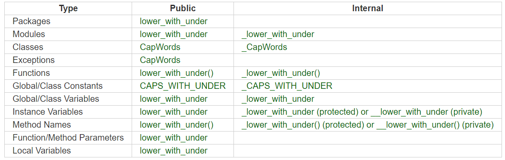

===================
De bonnes pratiques
===================

PEP = Python Enhancement Proposal

Conventions de nommage
----------------------

Noms à éviter
"""""""""""""

N'utilisez jamais les caractères suivants de manière isolée comme noms de variables :

* ``l`` (``L`` minuscule)
* ``O`` (``o`` majuscule)
* ``I`` (``i`` majuscule).

L'affichage de ces caractères dans certaines polices fait qu'ils peuvent être aisément confondus avec les chiffres ``0`` ou ``1``.

Noms des modules et packages
""""""""""""""""""""""""""""

Package : ``package``

Module : ``nom_du_module``

* noms courts
* constitués de lettres minuscules.
* noms de modules peuvent contenir des signes_(souligné)
* Bien que les noms de packages puissent également en contenir, la PEP 8 nous le déconseille.

Noms de classes
"""""""""""""""
``MaClasse``

Sans presque aucune exception, les noms de classes utilisent la convention suivante : la variable est écrite en minuscules, exceptée la première lettre de chaque mot qui la constitue.

Noms d'exceptions
"""""""""""""""""

``CustomError``
 
Les exceptions étant des classes, elles suivent la même convention. En anglais, si l'exception est une erreur, on fait suivre le nom du suffixe ``Error`` (vous retrouvez cette convention dans ``SyntaxError``, ``IndexError``…).

Noms de variables, fonctions et méthodes
""""""""""""""""""""""""""""""""""""""""

``nom_de_fonction``

``nom_de_variable``

La même convention est utilisée pour les noms de variables (instances d'objets), de fonctions ou de méthodes : le nom est entièrement écrit en minuscules et les mots sont séparés par des signes soulignés (``_``).

Méthodes non publiques et variables d'instance
""""""""""""""""""""""""""""""""""""""""""""""

``_non_public_method``

``_instance_variable``

Constantes
""""""""""

``NOM_DE_MA_CONSTANTE``

Les constantes doivent être écrites entièrement en majuscules, les mots étant séparés par un signe souligné (``_``).